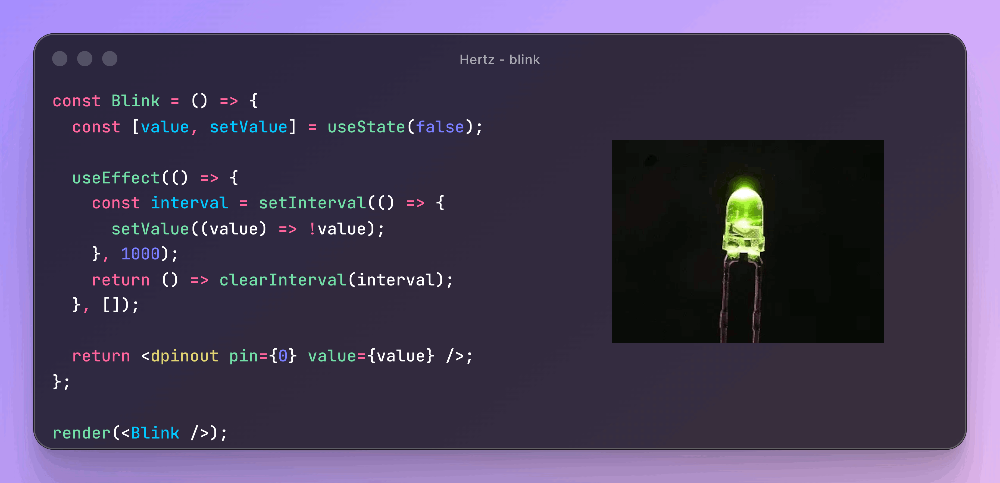

# React Hertz 💡

TODO:
- add hono
- get current state (telemetry)
- react dev tools
- error boundaries
    - onChange
    - on render
    - setTimeout
- test the framework



Hertz is a React framework (or reconciler/renderer) for driving hardware peripherals. **It projects the internal state of your React app to the physical world** instead of a [screen](https://www.npmjs.com/package/react-dom), [video](https://www.remotion.dev/) or [terminal](https://github.com/vadimdemedes/ink).

**NOTE**: This is very much a work in progress. The docs are lacking, the API is not stable and tests are largely non-existent. However, you are very much welcome to play around with the project.

## Quick start

You'll need some hardware to control. For now, Hertz supports the most basic peripherals for:
- [ClearCore](https://clearcore.ai/) - [docs](./src/bridges/clearcore/README.md),
- [Arduino](https://www.arduino.cc/) - [docs](./src/bridges/arduino/README.md) or
- [Raspberry Pi](https://www.raspberrypi.com/) - [docs](./src/bridges/raspberry/README.md).

However, it is very easy to write a bridge for your own hardware. See [Bring your own hardware](docs/bring-your-own-hardware.md) for more information.

Hertz needs to run **within a Node.js-like environment**. This means that:
1. Rasppbery Pi can control the hardware on the defice itself.
2. Arduino and other controlers incapable of running Node need to be controlled from a computer (for example using a serial connection).
3. You cannot run it in a browser.
4. There appears to be no reason why Hertz would be incompatible with Deno or Bun, but we did not test this as of yet.

### Project Setup and Installation
We suggest starting with a typescript project within node and using `tsx` to run the code. Then, install Hertz (only installation from GitHub is supported ATM):

```
pnpm add react github:zigapk/hertz
pnpm add serialport # Only if you need to communicate with hardware over a serial connection.
```

Depending on your settings and package manager, you might also need to run `pnpm approve-builds` or similar.

### Writing a program

This starter program works on a Raspberry Pi and makes GPIO 17 pin blink (toggle from low to high every second):

```tsx
# TODO: needs rpi bridge to be implemented first
```

## Why use React to drive hardware?

TODO: address the questions below:
- why not (the leds in amoled example)
- clean code & safety
  - ease of programming
  - wrapping whole parts of tree in guards
- ecosystem (queries, ability to mount router etc)
- connecting web and hardware developers

## Important Concepts

Hertz has a few gotchas that we'd like to put forth here:

### Peripherals are created and updated from the root of the tree to the leaves
This means that if you put component B inside component A, A is guaranteed to have been initialized and updated its props to the latest state before the same happens for B.
```tsx
<A prop1={value}>
    <B prop2={value} />
</A>
```

### Peripherals might clash with each other
Depending on the peripheral type, you might encounter clashes if you try to control the same physical peripheral from multiple places in the React tree. This is no different from what happens if you overwrite a pin in a regular program (say C), but let's look at two examples nonetheless.

**Example 1**: Clashing and overwriting digital pins will result in one of them overriding the other.
```tsx
<dpinout pin={0} value={true} />
<dpinout pin={0} value={false} />
```

**Example 2**: Setting different pin modes might lead to hardware damage depending on the circuit connected to the pin.
```tsx
<dpinout pin={1} value={true} />
<dpinin pin={1} onChange={console.log} />
```

However, it might be completley fine to do this in some cases like reading from the same pin in different places, controlling different aspects of the same peripheral (say, setting whether a stepper motor is enabled and its position). This depends on the peripheral itself and its bridge implementation. For example, this is just fine within Hertz's ClearCore bridge implementatin:

```tsx
<motor port={0} enabled={true} />
   <motor target={{ position: 100 }} />
</motor>
```

## TODO

TODO:
- docs
- add arduino and clearcore bridges
- add ci
- expose this as a package installable from github
- event loop should allow for more controll
- destruct peripherals


## Safety and Warranty

This software is designed to interface with and control physical hardware. Therefore, there is an inherent risk of damage to connected equipment and potential for personal injury. By using this software, you acknowledge and accept full responsibility for any such damage or injury. The creators and contributors of this project shall not be held liable for any hardware damage, data loss, personal injury, or other consequences resulting from the use of this software. Use it at your own risk.
