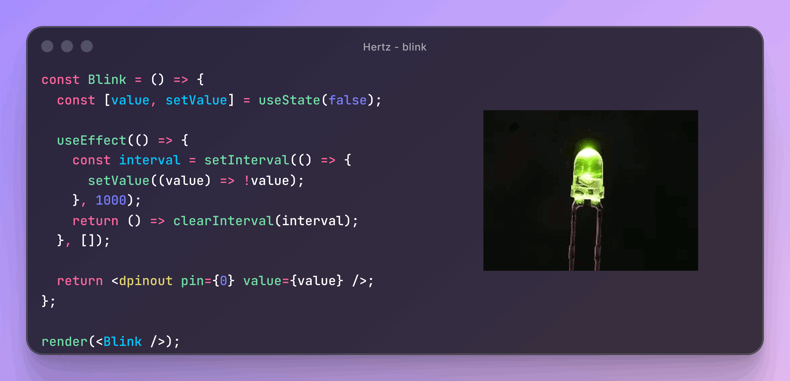

# React Hertz 💡



Hertz is a React framework (or reconciler/renderer) for driving hardware peripherals. **It projects the internal state of your React app to the physical world** instead of a [screen](https://www.npmjs.com/package/react-dom), [video](https://www.remotion.dev/) or [terminal](https://github.com/vadimdemedes/ink).

**NOTE**: This is still a work in progress. APIs may change and coverage is incomplete, but the project is usable for experimentation.

## Why use this reconciler for robots

Hertz gives you React ergonomics for hardware control while keeping execution in a Node runtime.

- Declarative hardware tree: describe target hardware state as components and props.
- Built-in lifecycle mapping: mount/update/unmount map to peripheral init/apply/disown methods.
- Parent-first initialization: parent peripherals initialize before children.
- Poll-driven input updates: readable hardware values are queried and surfaced via `on...Change` callbacks.
- Error propagation through React boundaries: hardware/runtime errors bubble to standard React error boundaries.
- External telemetry store: publish selected robot state for CLIs, dashboards, and monitoring.

## What this repository provides

Hertz is primarily a framework for building hardware reconcilers with React. This repository currently includes:

- the reconciler/runtime,
- telemetry utilities for publishing robot state outside React,
- a working ClearCore bridge and examples.

## Bridge status

| Bridge | Status | Notes |
| --- | --- | --- |
| ClearCore | Available | Active example bridge in `src/bridges/clearcore` |
| Arduino | Planned | Not implemented yet |
| Raspberry Pi | Planned | Not implemented yet |

See bridge-specific docs:

- ClearCore: `src/bridges/clearcore/README.md`
- Arduino (planned): `src/bridges/arduino/README.md`
- Raspberry Pi (planned): `src/bridges/raspberry/README.md`
- Bring your own hardware: `docs/bring-your-own-hardware.md`
- Testing: `docs/testing.md`

## Runtime model

Hertz runs in a Node.js-like runtime, not in a browser.

- `Node.js` is the primary target.
- `Bun`/`Deno` might work but are not officially tested yet.
- Devices that cannot run Node directly (for example microcontrollers) are controlled from a host process over a transport such as serial.

## Quick start (ClearCore)

1. Install dependencies in your project:

```bash
pnpm add react github:zigapk/hertz
pnpm add serialport
pnpm add llamajet-driver-ts
```

2. Flash ClearCore firmware from `src/bridges/clearcore/firmware/firmware.ino`.

3. Create the most basic program (blink one digital output pin):

```tsx
import { ClearCore } from "llamajet-driver-ts";
import { useEffect, useState } from "react";
import { SerialPort } from "serialport";
import { CCDPinOut, clearCorePeripherals, createReconciler } from "hertz";

const Blink = () => {
	const [value, setValue] = useState(false);

	useEffect(() => {
		const timer = setInterval(() => {
			setValue((current) => !current);
		}, 1000);

		return () => clearInterval(timer);
	}, []);

	return <CCDPinOut pin={3} value={value} />;
};

async function main() {
	const clearcore = new ClearCore(
		new SerialPort({
			path: "/dev/ttyACM0",
			baudRate: 115200,
		}),
	);

	await clearcore.connect();

	const { render, runEventLoop } = createReconciler(
		clearCorePeripherals,
		clearcore,
	);

	render(<Blink />);
	await runEventLoop();
}

void main();
```

4. Use one of the richer examples as a next step:

- `src/examples/clearcore-blink.tsx`
- `src/examples/clearcore-complex.tsx`
- `src/examples/clearcore-motor-position.tsx`
- `src/examples/clearcore-motor-velocity.tsx`
- `src/examples/clearcore-error-boundary.tsx`
- `src/examples/clearcore-blink-with-telemetry.tsx`

The ClearCore bridge communicates over serial through `llamajet-driver-ts`, which expects the firmware protocol implemented by `firmware.ino`.

## Error handling and propagation

Hertz peripherals are wrapped by higher-level React components (`createHigherLevelComponent`) that propagate peripheral errors into the React tree:

1. Peripheral lifecycle/read methods catch errors.
2. They call an internal `onError` callback.
3. The wrapper stores the error in state and throws it on the next render.
4. A React `ErrorBoundary` above the peripheral catches it.

That means you can use standard React error boundaries to isolate failing robot subtrees and render safe fallbacks.

```tsx
import { ErrorBoundary } from "react-error-boundary";
import { CCDPinIn, CCDPinOut } from "hertz";

const FaultyPeripheral = () => {
	return (
		<>
			<CCDPinOut pin={0} value={true} />
			<CCDPinIn
				pin={1}
				onValueChange={(value) => {
					if (value) {
						throw new Error("Pin 1 is HIGH");
					}
				}}
			/>
		</>
	);
};

const Fallback = (_props: { resetErrorBoundary: () => void }) => {
	return <CCDPinOut pin={2} value={true} />;
};

const Program = () => {
	return (
		<ErrorBoundary FallbackComponent={Fallback}>
			<FaultyPeripheral />
		</ErrorBoundary>
	);
};
```

For a complete runnable example, see `src/examples/clearcore-error-boundary.tsx`.

## Telemetry (reading robot state outside React)

Telemetry lets you project selected React state into an external store so non-React code can observe it (CLI, dashboards, logs, safety monitors).

```tsx
type Telemetry = {
	blink: {
		phase: "on" | "off";
		toggles: number;
	};
};

const telemetry = createTelemetryStore<Telemetry>({
	blink: { phase: "off", toggles: 0 },
});

useTelemetry<Telemetry, ["blink"]>(["blink"], {
	phase: value ? "on" : "off",
	toggles,
});

telemetry.subscribeSelector(
	(snapshot) => snapshot.blink.phase,
	(next, previous) => console.log(`Phase changed: ${previous} -> ${next}`),
);
```

See `src/examples/clearcore-blink-with-telemetry.tsx` for an end-to-end example.

## Safety and warranty

This software controls physical hardware. Misconfiguration can damage equipment or cause injury. By using Hertz, you accept responsibility for safe setup, safe operation, and validation on your target hardware. The project maintainers are not liable for hardware damage, data loss, or personal injury resulting from use of this software.
